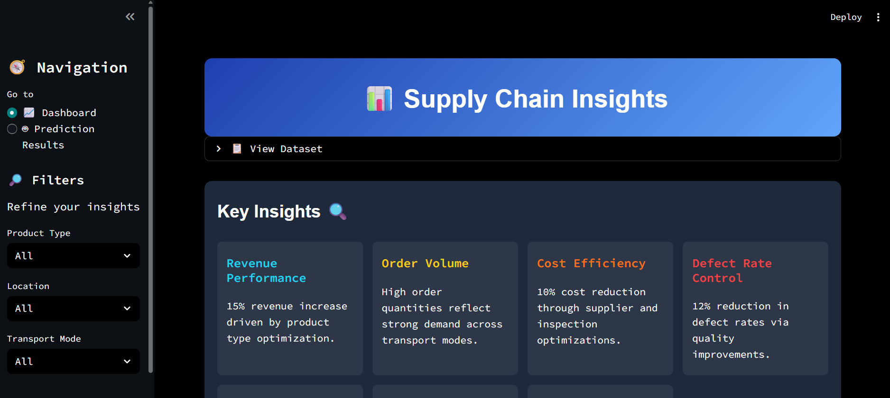
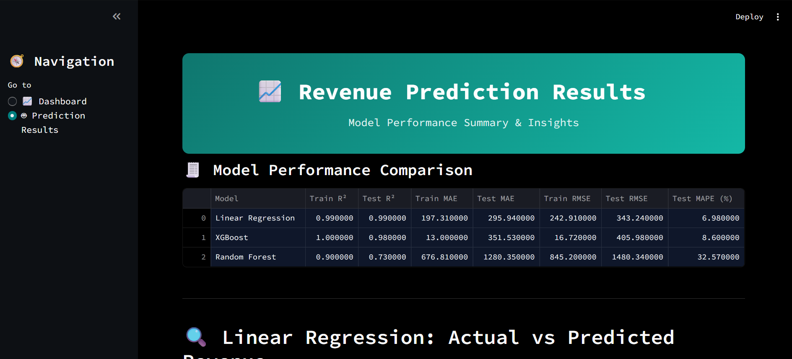

---

# Supply Chain Analysis Dashboard

## Overview

This Streamlit dashboard provides a comprehensive analysis of supply chain data, focusing on key metrics such as production volumes, stock levels, order quantities, revenue, manufacturing costs, lead times, shipping costs, transportation routes, risk factors, and sustainability factors. The interactive visualizations allow for an in-depth understanding of the supply chain's performance and highlight areas for improvement. Additionally, the integrated revenue prediction module leverages machine learning models like Linear Regression , Random Forest and XGBoost to forecast revenue trends, compare model performance, and provide data-driven insights for strategic decision-making.

## Features

- **Total Production Volumes, Stock Levels, and Lead Times**: Displays total values for production volumes, stock levels, and lead times with indicators.
- **Revenue Distribution by Location**: A pie chart showing revenue distribution across different locations.
- **Manufacturing Costs by Supplier**: Bar chart displaying the distribution of manufacturing costs by supplier.
- **Comparison of Price and Manufacturing Costs by Product Type**: Bar chart comparing the prices and manufacturing costs for different product types, along with profit margins.
- **Relationship between Production Volume, Stock Levels, and Order Quantities**: Polar chart illustrating the relationship between key supply chain metrics.
- **Distribution of Shipping Costs by Shipping Carriers**: Bar chart depicting the distribution of shipping costs among different shipping carriers.
- **Average Lead Time by Product Type**: Bar chart showing the average lead time for different product types.
- **Transportation Routes and Their Frequency**: Bubble chart representing the frequency of various transportation routes.
- **Supply Chain Risk Distribution by Risk Factors**: Bar chart showing the distribution of supply chain risks by different risk factors.
- **Sustainability Factors in the Supply Chain**: Pie chart analyzing the sustainability factors in the supply chain.

## Dataset Overview 

We worked with a dataset containing 100 rows and 24 columns, providing detailed insights into multiple dimensions of the supply chain.
The columns included are:

Product type
SKU
Price
Availability
Number of products sold
Revenue generated
Customer demographics
Stock levels
Lead times
Order quantities
Shipping times
Shipping carriers
Shipping costs
Supplier name
Location
Lead time
Production volumes
Manufacturing lead time
Manufacturing costs
Inspection results
Defect rates
Transportation modes
Routes
Costs

## Deployed Web App Overview

### Analysis Page

### Modelling & Revenue Prediction Page

### Model Overview and Results

For revenue prediction, we implemented three models — **Linear Regression**, **Random Forest Regressor**, and **XGBoost Regressor** — and compared their performance using key evaluation metrics. The **Linear Regression model** achieved a **Train R² of 0.99** and **Test R² of 0.98**, with a **Test MAE of 295.94** and **Test RMSE of 343.24**, showing excellent predictive accuracy and generalization. The **XGBoost model** followed closely with a **Train R² of 1.00** and **Test R² of 0.98**, though its **Test MAE (351.53)** and **Test RMSE (405.98)** were slightly higher, indicating a bit of overfitting despite strong training performance. The **Random Forest model**, however, recorded a **Train R² of 0.90** and **Test R² of 0.73**, along with a significantly higher **Test MAE of 1280.35** and **Test RMSE of 1480.34**, suggesting weaker generalization and higher prediction errors. Overall, the **Linear Regression model** proved to be the most stable and accurate among the three, making it the preferred choice for reliable revenue forecasting.

---

## **Author**

**Ashutosh Sahoo**  
**Computer Science and Engineering**  
**Specialization:** Data Science and Analytics | IIIT Nagpur  
**Email:** [sahooashutosh792@gmail.com](mailto:sahooashutosh792@gmail.com)

---
